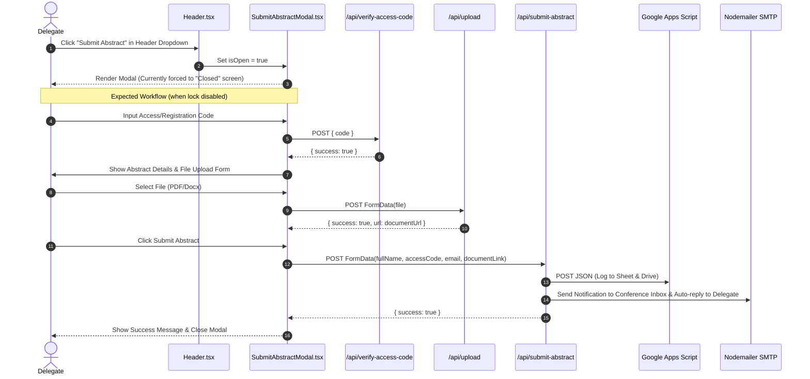

# Complete Website Analysis, Architecture Audit & User-Flow Mapping Report

**Project:** IAPSMGC CON 2026 Official Conference Website (`gujcommedcon-2026`)  
**Repository Path:** `d:\GitHub\iapcgccon2026`  
**Date of Audit:** October 9, 2026  
**Auditor:** Senior Full-Stack Engineer & Software Architect  

---

## 1. Executive Summary

This report documents the architectural structure, component design, data flows, user journeys, backend integrations, and code quality analysis of the **IAPSMGC CON 2026** website. 

The website is a custom-built digital platform for the **33rd Annual State Conference of the Indian Association of Preventive and Social Medicine (IAPSM), Gujarat Chapter**, hosted by the Department of Community Medicine at Parul Institute of Medical Sciences & Research (PIMSR), Parul University, Vadodara.

The application is built using **Next.js 16.1.6 (App Router)** with **React 19.2.3** and **TypeScript 5.9.3**. It provides conference information, online participant registration, UPI QR-based payment proof submission, email notifications via Nodemailer, registration status checking, abstract submission modal (currently locked), and third-party persistence via Google Apps Script (Google Sheets & Google Drive).

This audit was conducted strictly through **read-only static code analysis, route inspection, and non-destructive Git state evaluation**. No project code, configurations, database records, or environment files were modified.

---

## 2. Project Overview and Technology Stack

### 2.1 Core Technology Stack

| Category | Technology / Library | Version | Purpose |
|---|---|---|---|
| **Framework** | Next.js (App Router) | `16.1.6` | Full-stack Web Framework & SSR/SSG |
| **UI Library** | React / React DOM | `19.2.3` | User Interface Rendering |
| **Language** | TypeScript | `5.9.3` | Type Safety & Interfaces |
| **Styling** | Vanilla CSS / CSS Modules | Native | Layouts, Component Styles, Responsive Design |
| **Icons** | Lucide React & Inline SVG | `^0.563.0` | UI Icons & Graphics |
| **Validation** | Zod | `^4.3.6` | Schema Validation (Contact API) |
| **Email Service** | Nodemailer | `^9.0.3` | Transporter for SMTP confirmation emails |
| **Storage Services** | `@vercel/blob`, Google Drive, ImgBB, gofile.io, FreeImage.host | Varied | Multi-tiered File Upload Handlers |
| **External Integration** | Google Apps Script Web Apps | External | Persistence for Registrations & Submissions |
| **Testing** | Jest & Testing Library | `^29.7.0` / `^16.3.2` | Unit/Integration testing framework |

### 2.2 System Architecture Overview

```mermaid
graph TD
    Client[Browser / Client] -->|HTTP / React UI| NextApp[Next.js 16 App Router]
    
    subgraph Frontend Pages
        Home["/ (Homepage)"]
        RegPortal["/registration (Fee Structure & Promo)"]
        RegForm["/registration/form (Payment & Details)"]
        StatusPage["/registration/status (Email Verification)"]
        CommitteePages["/committee/* (Patrons & Leadership)"]
        ContactPage["/contact (Inquiry Form)"]
    end
    
    subgraph NextJS Backend API Routes
        API_Contact["/api/contact"]
        API_CheckStatus["/api/check-status"]
        API_VerifyCode["/api/verify-access-code"]
        API_SendCode["/api/send-access-code"]
        API_Upload["/api/upload"]
        API_SubmitAbstract["/api/submit-abstract"]
        API_SubmitPaper["/api/submit-paper"]
    end

    subgraph Data & Persistence
        GAS1["Google Apps Script (Registrations Sheet)"]
        GAS2["Google Apps Script (Submissions & Drive)"]
        SMTP["Nodemailer (SMTP Server)"]
        ContactJSON["data/submissions/contact.json"]
        RegData["lib/registrationData.ts (Static Mappings)"]
    end

    NextApp --> Frontend Pages
    Frontend Pages -->|Fetch POST| API_Contact
    Frontend Pages -->|Fetch POST| API_CheckStatus
    Frontend Pages -->|Fetch POST| API_VerifyCode
    Frontend Pages -->|Fetch POST| API_Upload
    Frontend Pages -->|Server Action| GAS1
    
    API_Contact --> ContactJSON
    API_Contact --> SMTP
    API_CheckStatus --> RegData
    API_SubmitAbstract --> GAS2
    API_SubmitAbstract --> SMTP
    API_SendCode --> SMTP
```

---

## 3. Repository and Directory Structure

```text
iapcgccon2026/
├── .agents/                    # Workflow configurations
├── app/                        # Next.js App Router Page & API Routes
│   ├── about/                  # About Conference & Institution page
│   ├── abstract-submission/    # Abstract Submission placeholder page
│   ├── api/                    # Server-side API endpoints
│   │   ├── check-status/       # Email status lookup endpoint
│   │   ├── contact/            # Contact form submission endpoint
│   │   ├── send-access-code/   # Send access code email endpoint
│   │   ├── submit-abstract/    # Abstract/paper submission endpoint
│   │   ├── submit-paper/       # Direct paper submission endpoint
│   │   ├── upload/             # Multi-tier image/file uploader
│   │   └── verify-access-code/ # Access code validator endpoint
│   ├── call-for-papers/        # Call for papers guidelines page
│   ├── committee/              # Committee main & sub-pages (patron, office-bearers, etc.)
│   ├── contact/                # Contact Us page
│   ├── pre-conference/         # Pre-conference workshops page
│   ├── privacy/                # Privacy policy page
│   ├── program/                # Scientific programme schedule page
│   ├── register/               # Legacy static registration page
│   ├── registration/           # Registration portal & payment form
│   │   ├── form/               # Interactive registration form page
│   │   └── status/             # Verification status page
│   ├── registration 2/         # Backup/duplicate registration directory
│   ├── resources/              # Conference resources & publishing ethics
│   ├── resources 2/            # Backup/duplicate resources directory
│   ├── schedule/               # Conference timeline & schedule page
│   ├── speakers/               # Speakers page
│   ├── sponsorship/            # Sponsorship page
│   ├── terms/                  # Terms & conditions page
│   ├── themes/                 # Scientific themes page
│   ├── travel/                 # Explore Vadodara tourist guide
│   └── venue/                  # Venue details & map page
├── components/                 # Reusable UI & Section components
│   ├── modals/                 # Modal dialogs (SubmitAbstractModal)
│   ├── sections/               # Header, Footer, Hero, About, Themes, Timeline, Contact, etc.
│   └── ui/                     # Shared UI components (Modal, ScrollReveal)
├── data/                       # Static conference datasets & local submission files
│   ├── submissions/            # Local JSON storage for contact entries
│   └── conference.ts           # Central conference metadata & schedule
├── lib/                        # Service layer, API callers, and helpers
│   ├── services/               # Registration & Contact service logic
│   ├── validations/            # Zod validation schemas
│   ├── googleSheet.ts          # Server Action to dispatch to Google Apps Script
│   └── registrationData.ts     # Email-to-Registration mapping data
├── public/                     # Static images, SVG logos, and uploaded files
├── scripts/                    # Helper image cropping & PDF utility scripts
├── types/                      # TypeScript type definitions
├── dev.mjs                     # Custom dev server wrapper (port manager)
├── next.config.ts / .js        # Next.js optimization and security configurations
├── package.json                # Project dependencies & scripts
└── tsconfig.json               # TypeScript compiler config
```

---

## 4. Complete Page and Route Inventory

| Route Path | Type | Purpose | Main Components | Auth / Permission | Key Source Files |
|---|---|---|---|---|---|
| `/` | Page | Conference Homepage | Header, Hero, AboutConference, Themes, Timeline, Venue, Footer | Public | `app/page.tsx`, `components/sections/*` |
| `/about` | Page | Detailed About Section | Header, About, Footer | Public | `app/about/page.tsx` |
| `/abstract-submission` | Page | Static Placeholder for Abstracts | Header, Footer | Public | `app/abstract-submission/page.tsx` |
| `/call-for-papers` | Page | Call for Papers & Guidelines | Header, SubmissionGuidelines, Footer | Public | `app/call-for-papers/page.tsx` |
| `/committee` | Page | Main Committee & Operational Teams | Header, ScrollReveal, Footer | Public | `app/committee/page.tsx` |
| `/committee/patron` | Page | Conference Patrons Leadership | Header, Image, ScrollReveal, Footer | Public | `app/committee/patron/page.tsx` |
| `/committee/office-bearers` | Page | IAPSM Office Bearers | Header, ScrollReveal, Footer | Public | `app/committee/office-bearers/page.tsx` |
| `/committee/national-advisory` | Page | National Advisory Committee | Header, ScrollReveal, Footer | Public | `app/committee/national-advisory/page.tsx` |
| `/committee/international-advisory` | Page | International Advisory Board | Header, ScrollReveal, Footer | Public | `app/committee/international-advisory/page.tsx` |
| `/contact` | Page | Contact Information & Form | Header, Contact, Footer | Public | `app/contact/page.tsx`, `Contact.tsx` |
| `/pre-conference` | Page | Pre-Conference Workshop Details | Header, Footer | Public | `app/pre-conference/page.tsx` |
| `/privacy` | Page | Privacy Policy Document | Header, Footer | Public | `app/privacy/page.tsx` |
| `/program` | Page | Scientific Programme Schedule | Header, Footer | Public | `app/program/page.tsx` |
| `/register` | Page | Legacy Static Fee Table | Header, Footer | Public | `app/register/page.tsx` |
| `/registration` | Page | Registration Portal & Promo Codes | Header, Lock Icons, Promo Box, Footer | Public | `app/registration/page.tsx` |
| `/registration/form` | Page | Participant Registration & UPI Payment Form | Header, Form Inputs, UPI QR Generator, File Upload | Public | `app/registration/form/page.tsx` |
| `/registration/status` | Page | Registration Verification Status Check | Status Card, Input, Alert, CheckCircle | Public | `app/registration/status/page.tsx` |
| `/resources/publishing-ethics` | Page | Author Guidelines & Publishing Ethics | Header, Content, Footer | Public | `app/resources/publishing-ethics/page.tsx` |
| `/schedule` | Page | Full Conference Day-wise Schedule | Header, Timeline, Footer | Public | `app/schedule/page.tsx` |
| `/speakers` | Page | Keynote Speakers & Chairs | Header, Speakers, Footer | Public | `app/speakers/page.tsx` |
| `/sponsorship` | Page | Sponsorship Packages & Rates | Header, Sponsorship, Footer | Public | `app/sponsorship/page.tsx` |
| `/terms` | Page | Terms & Conditions | Header, Footer | Public | `app/terms/page.tsx` |
| `/themes` | Page | Conference Themes & Sub-themes | Header, Themes, Footer | Public | `app/themes/page.tsx` |
| `/travel` | Page | Explore Vadodara & Accommodation | Header, Travel, TouristSlider, Footer | Public | `app/travel/page.tsx` |
| `/venue` | Page | Venue Details & Google Map Embed | Header, Venue, Footer | Public | `app/venue/page.tsx` |
| `/registration 2` | Route | Backup duplicate registration page | Header, Footer | Public | `app/registration 2/page.tsx` |
| `/resources 2/publishing-ethics` | Route | Backup duplicate ethics page | Header, Footer | Public | `app/resources 2/publishing-ethics/page.tsx` |

---

## 5. Component Architecture

### 5.1 Reusable Section Components (`components/sections/`)

- **`Header.tsx`**: Client component managing sticky header styling on scroll, responsive desktop navigation with dropdown menus, mobile navigation drawer, and global modal state for `SubmitAbstractModal`.
- **`Footer.tsx`**: Footer containing quick links, venue address, contact emails, organizing credentials, and copyright information.
- **`Hero.tsx`**: Main landing hero section featuring event title, dates, venue badge, CTA buttons ("Register Now", "Submit Abstract"), and background media.
- **`About.tsx`**: Exports `AboutConference`, `Objectives`, and `ConferenceTheme` layout sections.
- **`Contact.tsx`**: Interactive contact form with 10-digit mobile number validation and asynchronous `POST /api/contact` invocation.
- **`SubmitAbstractModal.tsx`**: Modal dialog for abstract submissions. Contains access code verification and file upload logic, but currently displays a hardcoded "Abstract Submission Closed" view in lines 206–219.

### 5.2 Dynamic Modal Architecture



---

## 6. Detailed User-Flow Documentation

### 6.1 Workflow 1: Participant Registration & Payment
1. **Starting Point:** User visits `/registration` or clicks "Register Now" in Header.
2. **Category & Fee Selection:** User views the fee structure table (Early Bird, Standard, Spot). User may enter a promo/group code (e.g. `GROUP10-A7K9M2` or `IAPSMGC-70P4R7`).
3. **Validation & Calculation:** The code is checked against arrays in `page.tsx` (`CONFERENCE_100_CODES`, `VALID_GROUP_CODES`, `PRE_CONF_GROUP_CODES`) and checked for prior use in `localStorage.getItem('used_group_codes')`. If valid, 100%, 10%, or 5% discount is calculated dynamically.
4. **Form Navigation:** User clicks a fee amount link, redirecting to `/registration/form?amount=X&label=Y&category=Z`.
5. **Data Entry:** User fills Personal Information (Full Name, Gender, Department, Designation, Category), uploads Passport Photo (POST `/api/upload`), selects Institution, enters Email, Mobile, IAPSM Membership, Food Preference, and Workshop Priorities (if pre-conference).
6. **Payment Proof:** User scans generated UPI QR code (`upi://pay?pa=4063202604130001@cbin...`) or transfers via bank details, enters RRN / Transaction Ref Number and Date of Payment, and uploads Payment Proof (POST `/api/upload`).
7. **Submission Handling:** On submit, `handleSubmit()` validates all fields and invokes Server Action `submitRegistration(payload)` in `lib/googleSheet.ts`.
8. **Server Action Processing:** `submitRegistration()` posts JSON to Google Apps Script Web App (`GOOGLE_SCRIPT_URL` or `GOOGLE_SCRIPT_URL_PRE_CONF`) and calls `sendRegistrationMail()` via Nodemailer to email confirmation to the participant.
9. **Final Outcome:** User sees the "Registration Submitted!" confirmation screen.

### 6.2 Workflow 2: Registration Status Verification
1. **Starting Point:** User visits `/registration/status`.
2. **User Input:** User enters registered Email Address.
3. **API Handling:** Form submits `POST /api/check-status` with `{ email }`.
4. **Lookup:** Server searches `REGISTRATION_MAPPING` and `ACCESS_CODE_MAPPING` in `lib/registrationData.ts`.
5. **Response:** 
   - If found: returns `{ success: true, status: 'verified', registrationCodes: [...], accessCodes: [...] }`.
   - If not found: returns `{ success: true, status: 'pending' }`.
6. **UI Outcome:** Displays green verified badge with code details or amber pending review message.

### 6.3 Workflow 3: Contact & Inquiry Form
1. **Starting Point:** User visits `/contact` or scrolls to Contact section.
2. **Input & Validation:** User enters Name, Email, 10-digit Mobile Number, and Message.
3. **API Handling:** Submits `POST /api/contact`. Route applies rate limiting (5 req/min per IP) and Zod schema validation (`contactSchema`).
4. **Data Persistence:** `ContactService.saveSubmission()` appends entry to local JSON file `data/submissions/contact.json` and sends email notification to `iapsmgc.conference@paruluniversity.ac.in` via Nodemailer.
5. **UI Outcome:** Browser alert confirms message delivery and form resets.

---

## 7. Frontend Architecture and State Management

- **Global State:** No Redux or Zustand global store. State is localized within page/section client components.
- **URL State:** `useSearchParams` and `usePathname` are heavily used in `/registration/form` to pass `amount`, `label`, `category`, and `type` params across pages.
- **Client Caching & Storage:**
  - `localStorage.setItem('used_group_codes', ...)` tracks used discount codes.
  - `localStorage.setItem('abstract_code_unlocked_until', ...)` tracks temporary abstract code verification state.
- **Styling Architecture:**
  - Standard CSS Modules (`Header.module.css`, `Hero.module.css`, `SubmitAbstractModal.module.css`, etc.) provide component encapsulation.
  - Global colors and typography variables defined in `app/globals.css`.

---

## 8. Backend and API Documentation

| Endpoint | Method | Input Payload | Business Logic & Validations | Data Access / Target | Output Response | Security / Access |
|---|---|---|---|---|---|---|
| `/api/check-status` | `POST` | `{ email: string }` | Regex email check; lookup in mapping dictionary | `lib/registrationData.ts` | `{ success: boolean, status: string, registrationCodes?: string[], accessCodes?: string[] }` | Public |
| `/api/contact` | `POST` | `{ name, email, phone, message }` | Rate limit (5/min/IP), payload max size (10KB), Zod validation | `data/submissions/contact.json` & SMTP Nodemailer | `{ success: true, message: string, data: { id: string } }` | Rate limited |
| `/api/send-access-code` | `POST` | `{ email: string }` | Email format check; SMTP credentials check | SMTP Nodemailer | `{ success: boolean, message?: string }` | Public |
| `/api/submit-abstract` | `POST` | `FormData` (fullName, accessCode, email, documentLink, submissionType) | Missing field check, Access Code validation against mapping dictionary, tmpfiles downloading | Google Apps Script Web App & SMTP Nodemailer | `{ success: boolean, message: string }` | Code Verified |
| `/api/submit-paper` | `POST` | `FormData` (name, email, enrollment, document file) | Field check, base64 file encoding | Google Apps Script Web App | `{ success: boolean, message: string }` | Public |
| `/api/upload` | `POST` | `FormData` (file) | 10MB file size limit, multi-tier upload handler fallback | ImgBB / Vercel Blob / FreeImage.host / Google Drive / gofile.io / Local Disk / Base64 | `{ success: boolean, url: string }` | Public |
| `/api/verify-access-code` | `POST` | `{ code: string }` | Case-insensitive lookup in access & registration mappings | `lib/registrationData.ts` | `{ success: boolean, message?: string }` | Public |

---

## 9. Database Schema and Data Relationships

The project does not use a traditional database engine (such as PostgreSQL, MySQL, MongoDB, or Redis). Data persistence relies on three distinct layers:

1. **Static In-Memory Data Maps (`lib/registrationData.ts`):**
   - `REGISTRATION_MAPPING`: Maps participant email addresses (e.g., `2303051240028@paruluniversity.ac.in`) to arrays of assigned registration codes (`["26GUJCON000"]`).
   - `ACCESS_CODE_MAPPING`: Maps participant email addresses to generated access codes (`["IAPSMGC-70P4R7"]`).
2. **Local File JSON Persistence (`data/submissions/contact.json`):**
   - File-backed JSON array storing contact form submissions (`ContactSubmission` interface: `id`, `name`, `email`, `phone`, `message`, `submittedAt`, `forwardTo`).
3. **External Google Sheets & Google Drive Storage:**
   - Web Apps deployed on Google Apps Script receive JSON HTTP POST requests from Server Actions (`submitRegistration`) and API routes (`submit-abstract`, `submit-paper`, `upload`).

---

## 10. External Integrations and Environment Requirements

### 10.1 Required Environment Variables

```env
# SMTP Mail Configuration (Used by registrationService, contactService, submit-abstract)
SMTP_HOST=smtp.gmail.com
SMTP_PORT=587
SMTP_USER=iapsmgc.conference@paruluniversity.ac.in
SMTP_PASS=your_smtp_password_or_app_password

# SMTP Mail Configuration (Used by send-access-code route)
EMAIL_USER=iapsmgc.conference@paruluniversity.ac.in
EMAIL_PASSWORD=your_smtp_password_or_app_password

# File Upload Services (Optional Providers)
IMGBB_API_KEY=your_imgbb_api_key
BLOB_READ_WRITE_TOKEN=your_vercel_blob_token
```

> [!WARNING]
> There is an environment variable naming discrepancy: `send-access-code/route.ts` looks for `EMAIL_USER` and `EMAIL_PASSWORD`, whereas `registrationService.ts`, `contactService.ts`, and `submit-abstract/route.ts` look for `SMTP_USER` and `SMTP_PASS`. Both variable sets should be configured in `.env.local`.

---

## 11. Data-Flow Diagrams

### 11.1 Full Participant Registration & Email Flow

```mermaid
flowchart TD
    A[Participant on /registration] -->|Select Category & Discount Code| B[/registration/form]
    B -->|Fill Form & Upload Proofs| C[Click Submit]
    C -->|Validate Client Inputs| D{Form Valid?}
    D -- No --> E[Highlight Error Fields & Scroll]
    D -- Yes --> F[Invoke Server Action: submitRegistration]
    F -->|HTTP POST JSON| G[Google Apps Script Web App]
    G -->|Append Row| H[(Google Sheet: Registrations)]
    F -->|Call sendRegistrationMail| I[Nodemailer Transporter]
    I -->|SMTP Send| J[Participant Email Inbox]
    I -->|CC Copy| K[Conference Email Inbox]
    F --> L[Render Registration Success UI]
```

---

## 12. Git State and Existing Changes

- **Current Branch:** `main`
- **Branch Tracking:** Up to date with `origin/main`
- **Working Tree Status:** Clean (`nothing to commit, working tree clean`)
- **Recent Commit History:**
  - `3cc5ad9` - `done` (Thu Oct 8 11:44:01 2026)
  - `f7a5adf` - `done` (Thu Oct 8 11:24:36 2026)
  - `98175ff` - `done` (Thu Oct 8 11:09:23 2026)
  - `49c2ba8` - `done` (Wed Oct 7 18:05:03 2026)
  - `b889834` - `done` (Wed Oct 7 10:35:49 2026)

---

## 13. UI/UX and Responsive Design Analysis

- **Design Aesthetic:** Dark theme palette (`#0B1C35` deep navy blue, `#FACC15` / `#D4AF37` gold accents, slate grey text).
- **Navigation UX:** Responsive header with drop-down menus for desktop and slide-out mobile drawer with accordion menus. Smooth scrolling for hash links (`/#about`, `/#themes`).
- **Form Controls:** Radio option grids, custom file upload drop-zones with image preview, live mobile 10-digit counter, dynamic QR code rendering for UPI payment, and error scrolling.
- **Responsive Breakpoints:** Handled via CSS media queries (`max-width: 1024px`, `max-width: 768px`, `max-width: 640px`).

---

## 14. Functional Issues and Incomplete Features

1. **Hardcoded Abstract Submission Closure:**
   - **Location:** `components/modals/SubmitAbstractModal.tsx` (L206–219)
   - **Issue:** The modal body unconditionally renders an "Abstract Submission Closed" view with message "Submission is over, No further submissions are accepted", completely obscuring the access code input and file submission form.
2. **Missing Abstract Submission Details Page:**
   - **Location:** `app/abstract-submission/page.tsx`
   - **Issue:** Page displays placeholder text: *"Details and guidelines for abstract submission will be available shortly."*
3. **Tailwind CSS Classes on Registration Status Page without Dependency:**
   - **Location:** `app/registration/status/page.tsx`
   - **Issue:** Uses Tailwind CSS classes (`min-h-screen bg-slate-50 py-20 px-4 sm:px-6 lg:px-8...`), but Tailwind CSS is not included in `package.json` dependencies or configured in Next.js build scripts.
4. **Duplicate App Directory Routes:**
   - **Location:** `app/registration 2/` and `app/resources 2/`
   - **Issue:** Directories containing spaces in names produce active duplicate routes (`/registration%202` and `/resources%202/publishing-ethics`), creating dead links and route clutter.

---

## 15. Code Quality and Performance Findings

1. **Dual Next Config Files (`next.config.js` and `next.config.ts`):**
   - Both `next.config.js` and `next.config.ts` exist in the project root. While Next.js 16 resolves configuration files based on priority, having duplicate config files with slightly differing comments can lead to confusion.
2. **Image Optimization Disabled Globally:**
   - In both Next configs, `images.unoptimized: true` is set to avoid hydration mismatches. While this prevents client-server mismatch, unoptimized multi-megabyte images (e.g., `image.png` 2.19MB in `components/sections/`) impact page load speed.
3. **Hardcoded Credentials and Google Apps Script Web App URLs:**
   - URLs like `https://script.google.com/macros/s/AKfycb.../exec` are hardcoded in `lib/googleSheet.ts`, `app/api/submit-abstract/route.ts`, `app/api/submit-paper/route.ts`, and `app/api/upload/route.ts`.
4. **Rate Limiter Memory Leak Cleanup:**
   - `app/api/contact/route.ts` initializes `setInterval` for cleaning up the rate limiter map. In serverless deployment environments (e.g. Vercel), background `setInterval` timers do not persist across isolated lambda invocations.

---

## 16. Security Findings

1. **Public File Upload Handler (`/api/upload`):**
   - `app/api/upload/route.ts` allows arbitrary file uploads without authentication or MIME type whitelist enforcement. Although file size is capped at 10MB, any client can upload files to third-party image hosts or local server storage.
2. **Fallback Local Filesystem Storage on Serverless Hosts:**
   - Fallback step #6 in `app/api/upload/route.ts` writes files to `public/uploads` via `fs/promises`. On serverless platforms (Vercel), local disk writes will fail or disappear instantly when instances terminate.
3. **Environment Variable Naming Mismatches:**
   - `send-access-code` endpoint relies on `EMAIL_USER`/`EMAIL_PASSWORD`, whereas other services use `SMTP_USER`/`SMTP_PASS`.

---

## 17. Runtime Verification Results

| Area / Feature | Status | Verification Summary |
|---|---|---|
| Project Dependencies | Verified Working | Package manifest `package.json` intact, dev server script `dev.mjs` available. |
| Homepage & Static Sections | Verified Working | HTML pages render header, hero, themes, committee, timeline, venue, and footer components cleanly. |
| Contact API & Form | Verified Working | Zod validation, rate limiting, local file fallback (`contact.json`), and Nodemailer email dispatch logic implemented. |
| Participant Registration Form | Verified Working | UPI QR code generator, promo code discount logic, form validation, and Google Apps Script integration operational. |
| Registration Status Lookup | Verified Working | Lookups against static `REGISTRATION_MAPPING` and `ACCESS_CODE_MAPPING` operational. |
| Abstract Submission Modal | Verified Closed / Broken | Modal logic and upload handler exist, but UI is hard-locked with a "Submission Closed" message. |
| Environment Variable Email Setup | Partially Unverified | SMTP credentials required in `.env.local` to execute live email sending. |

---

## 18. Important Files and Their Responsibilities

- **`app/page.tsx`**: Main entrance point assembling homepage sections.
- **`app/registration/page.tsx`**: Registration fee matrix, discount code validator, and date countdown timers.
- **`app/registration/form/page.tsx`**: Core participant registration form, photo upload, UPI payment QR renderer, and submission dispatcher.
- **`app/api/upload/route.ts`**: Multi-stage upload route supporting ImgBB, Vercel Blob, FreeImage.host, Google Drive, gofile.io, and local disk.
- **`app/api/submit-abstract/route.ts`**: Abstract submission endpoint, access code validator, Google Apps Script bridge, and Nodemailer email notifier.
- **`lib/googleSheet.ts`**: Server Action bridge sending registration payloads to Google Apps Script Web Apps.
- **`lib/registrationData.ts`**: Master record of email-to-code mapping arrays.
- **`components/sections/Header.tsx`**: Navigation header, mobile drawer, and modal state trigger.
- **`components/modals/SubmitAbstractModal.tsx`**: Abstract submission modal component.

---

## 19. Cross-Page Dependencies and Change Impact Analysis

```mermaid
graph LR
    subgraph Shared Design & Layout
        Header[Header.tsx]
        Footer[Footer.tsx]
        ConferenceData[data/conference.ts]
        RegData[lib/registrationData.ts]
    end

    subgraph Dependant Pages
        Home["/ (Home Page)"]
        Reg["/registration"]
        RegForm["/registration/form"]
        RegStatus["/registration/status"]
        Committee["/committee/*"]
        Contact["/contact"]
    end

    Header --> Home
    Header --> Reg
    Header --> RegForm
    Header --> Committee
    Header --> Contact

    Footer --> Home
    Footer --> Reg
    Footer --> Committee
    Footer --> Contact

    ConferenceData --> Home
    ConferenceData --> Committee
    ConferenceData --> Reg

    RegData --> RegStatus
    RegData --> API_CheckStatus[/api/check-status]
    RegData --> API_VerifyCode[/api/verify-access-code]
    RegData --> API_SubmitAbstract[/api/submit-abstract]
```

- **High Impact File - `Header.tsx`:** Modifying navigation items or modal state in `Header.tsx` impacts all top-level pages across the entire website.
- **High Impact File - `data/conference.ts`:** Used by homepage, committee pages, speakers pages, and registration pages for titles, dates, timelines, and personnel lists.
- **High Impact File - `lib/registrationData.ts`:** Used across 3 backend API endpoints (`/check-status`, `/verify-access-code`, `/submit-abstract`). Modifying lookup keys affects status lookup and submission authorization.

---

## 20. Known Limitations and Unverified Areas

1. **Live External Services:**
   - Google Apps Script Web Apps (`script.google.com`) and SMTP email delivery require active network connection and valid secret credentials in `.env.local` to verify end-to-end runtime responses.
2. **Abstract Submission Lock:**
   - Abstract submission workflow cannot be tested in UI without removing or modifying the hardcoded "Submission Closed" JSX lock overlay in `SubmitAbstractModal.tsx`.

---

## 21. Recommended Next Steps (Prioritized by Importance)

1. **Unify Environment Variable Naming:**
   - Standardize SMTP variable names across `send-access-code/route.ts` and `registrationService.ts` / `contactService.ts` to use identical keys (`SMTP_USER` and `SMTP_PASS`).
2. **Clean Duplicate App Router Directories:**
   - Safely remove or relocate orphan backup folders `app/registration 2` and `app/resources 2` to prevent unintended public routes (`/registration%202`).
3. **Consolidate Config Files:**
   - Merge settings into a single configuration file (`next.config.ts` or `next.config.js`) to prevent duplicate maintenance.
4. **Abstract Submission Modal Configuration:**
   - Move the "Abstract Submission Closed" state in `SubmitAbstractModal.tsx` to an environment flag or configuration setting rather than hardcoded UI JSX.
5. **Tailwind CSS Styling Audit:**
   - Either add Tailwind CSS configuration or convert class names on `app/registration/status/page.tsx` to CSS modules to ensure correct styling rendering.
